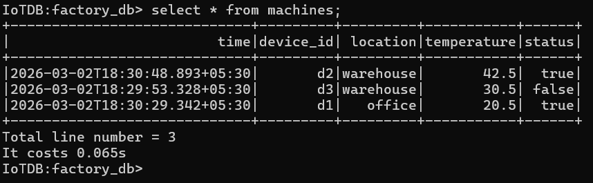
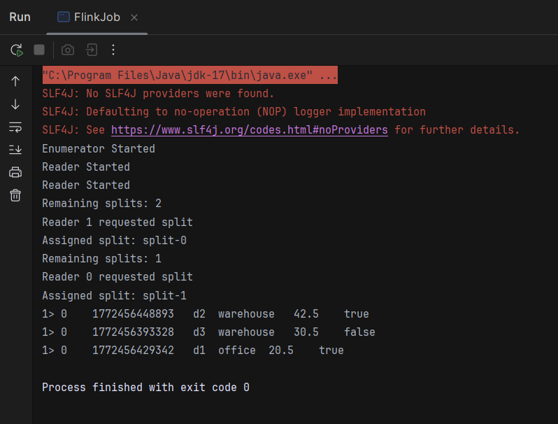

# Flink-IoTDB Table Connector (FLIP-27 POC)

A proof-of-concept Apache Flink source connector for Apache IoTDB 2.X Table Mode,
built using the modern FLIP-27 Source API with time-range based split architecture.

---

## Architecture

This connector implements the full FLIP-27 source pipeline:
```
IoTDB Database
      ↓
IoTDBSplitEnumerator     (runs on Flink JobManager)
→ divides global time range into splits
→ assigns splits to readers dynamically

IoTDBSourceReader × N    (runs on Flink TaskManagers)
→ executes bounded SQL query per split
→ emits one row per pollNext() call
→ requests next split on completion

Flink Pipeline
→ .print() sink — records printed to console in POC
→ production: .map(), .filter(), custom sinks etc
```

---

## Components

| Class | Role |
|---|---|
| `IoTDBSplit` | Immutable unit of parallelism — startTime/endTime boundaries |
| `IoTDBSplitSerializer` | Versioned serialization for checkpointing and network transfer |
| `IoTDBSplitEnumerator` | Divides time range by parallelism, assigns splits to readers |
| `IoTDBSourceReader` | Opens IoTDB session, executes query per split, emits records |
| `IoTDBSource` | Entry point — wires enumerator and reader together |
| `VoidSerializer` | Satisfies Flink's enumerator checkpoint contract (no state) |
| `FlinkJob` | Production entry point — runs the connector locally |
| `DataSetup` | Test utility — creates database and inserts sample data |
| `IoTDBFlinkTest` | JUnit test — verifies end-to-end record emission |

---

## Sample Data

The `DataSetup.java` utility creates a similar table and records in IoTDB:



---

## Connector Output

Running `FlinkJob.java` with parallelism=2 against the sample dataset produces:



The output confirms:
- Enumerator starts and creates splits correctly
- Both readers come online and request splits
- Splits are assigned dynamically per reader request
- Real IoTDB records are read and emitted downstream
- Job completes cleanly with exit code 0

---

## Prerequisites

- Java 17 
- Apache Maven 3.6+
- Apache IoTDB 2.X running on `localhost:6667`
- Apache Flink 1.17+ (runs locally — no cluster needed)

---

## Quick Start

### Step 1 — Start IoTDB

**Windows (PowerShell):**
```powershell
cd C:\iotdb\apache-iotdb-2.0.x
.\sbin\windows\start-confignode.bat   # terminal 1
.\sbin\windows\start-datanode.bat     # terminal 2
```

**Mac/Linux:**
```bash
  cd ~/iotdb/apache-iotdb-2.0.x
./sbin/start-confignode.sh    # terminal 1
./sbin/start-datanode.sh      # terminal 2
```

### Step 2 — Insert Test Data

Run `DataSetup.java` from IntelliJ (right click → Run) or via Maven:
```bash
  mvn exec:java -Dexec.mainClass="DataSetup"
```

This creates the `factory_db` database, the `machines` table with TAG/FIELD
columns, and inserts 6 sample sensor records across the configured time range.

Alternatively, run the SQL manually via IoTDB CLI:
```sql
CREATE DATABASE factory_db;
USE factory_db;

CREATE TABLE machines (
    device_id   STRING  TAG,
    location    STRING  TAG,
    temperature FLOAT   FIELD,
    active      BOOLEAN FIELD
);

INSERT INTO machines(time, device_id, location, temperature, active)
VALUES (1700000000000, 'd1', 'office', 22.5, true);

INSERT INTO machines(time, device_id, location, temperature, active)
VALUES (1710000000000, 'd2', 'warehouse', 30.5, false);

INSERT INTO machines(time, device_id, location, temperature, active)
VALUES (1720000000000, 'd1', 'office', 24.1, true);

INSERT INTO machines(time, device_id, location, temperature, active)
VALUES (1730000000000, 'd3', 'warehouse', 42.5, true);

INSERT INTO machines(time, device_id, location, temperature, active)
VALUES (1750000000000, 'd2', 'office', 19.8, false);

INSERT INTO machines(time, device_id, location, temperature, active)
VALUES (1780000000000, 'd1', 'warehouse', 35.0, true);
```

### Step 3 — Run the Connector

Run `FlinkJob.java` from IntelliJ (right click → Run).

### Step 4 — Run the Test

Run `IoTDBFlinkTest.java` from IntelliJ (right click → Run) to verify
end-to-end record emission via JUnit.

---

## Current Splitting Logic

The POC divides the global time range by parallelism:
```
globalStart = 1700000000000 (Nov 15 2023)
globalEnd   = 1800000000000 (May 18 2025)
parallelism = 2

split-0: 1700000000000 → 1750000000000
split-1: 1750000000000 → 1800000000000
```

Each reader processes its split independently and simultaneously.

---

## Planned Production Improvements

- **Fixed-size splits** independent of parallelism (splits >> parallelism)
  for better load balancing across uneven data distributions
- **Configurable `splitDelayMs`** to only assign splits older than a safe
  boundary, avoiding snapshot consistency issues with actively written ranges
- **`currentOffset` tracking** inside the reader for mid-split checkpoint recovery
- **Proper `isAvailable()` signaling** using incomplete `CompletableFuture`
  completed on `addSplits()` to eliminate idle CPU usage between splits
- **TAG/FIELD aware query construction** with filter and projection pushdown
- **IoTDB Sink implementation** for writing back to IoTDB table mode


